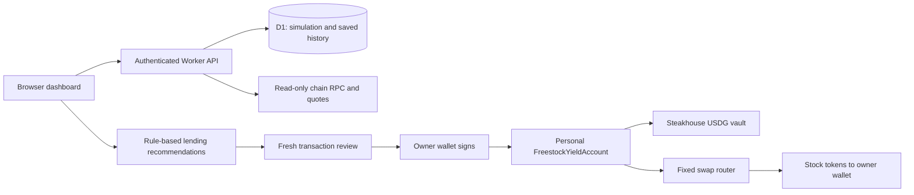

# Freestock

**Put available DeFi gains toward the stock tokens you choose.**

Freestock brings USDG lending, stock selections, rule-based lending recommendations and verified transaction history into one wallet dashboard. Choose a single stock or a basket, review what your available gains could buy, and approve the transaction yourself.

[Product](https://tryfreestock.com/) · [20-second intro](docs/media/freestock-intro.mp4) · [Backend](docs/BACKEND.md) · [Contracts](docs/CONTRACTS.md) · [Developer guide](docs/DEVELOPMENT.md) · [Roadmap](docs/PRODUCT-MILESTONES.md)

> **Public source · private pilot.** The hosted application is access controlled. Agentic Lending currently recommends actions; it does not move funds autonomously. Every financial transaction requires the owner's wallet approval. Publishing this repository does not enable unrestricted funded access.

## How it works

1. **Connect your wallet.** Create or restore your personal Freestock account on Robinhood Chain. The application verifies its deployment and fixed dependencies.
2. **Deposit USDG.** An exact approval and a separate deposit put USDG into the configured Steakhouse vault. You hold the account's ownership; the backend does not hold your keys.
3. **Choose where gains go.** Select a stock or basket, or retain gains. Your deposited principal has a separate accounting baseline. The simulation also lets you explore a split between stocks and reinvestment.
4. **Review a recommendation.** Agentic Lending checks the available surplus, your conversion minimum, stock allocation and estimated ETH gas budget. It explains whether to wait, retain gains or review a purchase.
5. **Approve and track.** Review a fresh quote in Freestock, then approve the transaction in your wallet. Confirmed stock purchases send tokens to your wallet. Portfolio Activity reconciles receipts with chain state and supports saved positions and exports.

## What is available

| Capability | Current implementation |
| --- | --- |
| USDG lending | One configured vault in a capped, wallet-approved private pilot |
| Stock purchases | NVDA, AAPL, TSLA, GOOGL and SPY; single stock or basket |
| Agentic Lending | Deterministic recommendations, explicit reasons and manual approval; no model or autonomous trader |
| Compounding | Reserve available gains by increasing the principal baseline; vault returns already accrue while shares are held |
| Withdrawal | Full exit in the primary interface; the contract also supports partial withdrawal |
| Portfolio Activity | Saved account references, pending/confirmed transaction tracking, bounded history import and exports |
| Lending market data | Read-only views of the tracked USDG and stock-lending markets |
| Try it yourself | Separate simulation modal with simulated balances and time advancement |
| Stock lending, staking and leveraged LP execution | Not enabled for funded transactions |
| Background conversion and cross-pool allocation | Not implemented; require a new permission and execution design |

The pilot's **100 USDG cap** applies when adding deposits against the account's principal baseline. It is not a lifetime contribution limit or a hard ceiling on account value. See [accounting and permissions](docs/CONTRACTS.md#accounting-and-the-cap).

## Architecture



The backend reads chain state, prepares unsigned transactions, verifies accounts and receipts, and stores user-scoped history. **It has no wallet private key or transaction broadcaster.** Application login and wallet ownership are separate concepts. Read the [backend guide](docs/BACKEND.md) for authentication, storage, APIs, reconciliation and failure handling.

## Contracts and addresses

Freestock uses a **per-user `FreestockYieldAccount`**. There is no shared Freestock account, factory or Freestock project-token address configured. Each participant deploys their own account from their wallet and can inspect that address in the dashboard and explorer.

| Configured dependency · Robinhood Chain, chain ID 4663 | Address |
| --- | --- |
| USDG | [`0x5fc5360D0400a0Fd4f2af552ADD042D716F1d168`](https://robinhoodchain.blockscout.com/address/0x5fc5360D0400a0Fd4f2af552ADD042D716F1d168) |
| Steakhouse USDG vault | [`0xBeEff033F34C046626B8D0A041844C5d1A5409dd`](https://robinhoodchain.blockscout.com/address/0xBeEff033F34C046626B8D0A041844C5d1A5409dd) |
| SwapRouter02 | [`0xcaf681a66d020601342297493863e78c959e5cb2`](https://robinhoodchain.blockscout.com/address/0xcaf681a66d020601342297493863e78c959e5cb2) |

These are the addresses configured in this source revision, not a guarantee of current liquidity, returns or provider eligibility. [The full contract reference](docs/CONTRACTS.md) includes all five enabled stock addresses, quote dependencies, permissions, functions, events and verification artifacts.

- [Solidity source](contracts/src/FreestockYieldAccount.sol)
- [ABI, bytecode and immutable offsets](contracts/artifacts/FreestockYieldAccount.artifact.json)
- [Exact compiler standard input](contracts/artifacts/account-standard-input.json)
- [Local-fork evidence and its limits](contracts/test/FORK-EXECUTION.md)

## What counts as available gains?

```text
account value = redeemable vault shares + idle USDG
available surplus = max(account value − principal baseline, 0)
```

Losses must recover above the principal baseline before gains can be spent. Direct USDG or vault-share donations also increase surplus; this is not a ledger that proves every gain came from lending interest. The client reserves two micro-USDG for rounding when preparing purchases.

A basket executes atomically: if a leg fails, the entire harvest reverts. The contract checks principal coverage around the swaps, but this does not guarantee principal value, future returns or withdrawal liquidity. Portfolio Activity totals cover the displayed page, not lifetime earnings or the wallet's full holdings.

## Explore the code

| Area | Entry points |
| --- | --- |
| Wallet dashboard and public pages | [`app/`](app), [`components/`](components) |
| Chain configuration and enabled stocks | [`lib/live/config.ts`](lib/live/config.ts), [`lib/live/basket.ts`](lib/live/basket.ts) |
| Unsigned preparation, simulation and receipts | [`lib/live/pilot.ts`](lib/live/pilot.ts), [`lib/live/account-plan.ts`](lib/live/account-plan.ts) |
| Recommendation rules | [`lib/live/agentic-lending.ts`](lib/live/agentic-lending.ts) |
| Browser transaction checks and recovery | [`lib/live/wallet-transaction.ts`](lib/live/wallet-transaction.ts), [`lib/live/wallet-journal.ts`](lib/live/wallet-journal.ts) |
| Saved history and chain reconciliation | [`lib/live/history-reader.ts`](lib/live/history-reader.ts), [`lib/live/history-store.ts`](lib/live/history-store.ts) |
| Simulation accounting | [`lib/earn-engine.ts`](lib/earn-engine.ts), [`lib/earn-store.ts`](lib/earn-store.ts) |
| API handlers and database migrations | [`app/api/`](app/api), [`drizzle/`](drizzle) |
| Regression checks | [`tests/`](tests), [`scripts/`](scripts) |

## Run locally

Use Node.js 22.13 or newer.

```sh
git clone https://github.com/flappyfart/freestock.git
cd freestock
npm ci
npm run dev
```

For database setup, local API fixtures, deployment configuration and the trusted-authentication boundary, follow the [developer guide](docs/DEVELOPMENT.md). The checkout uses React, TypeScript, Vinext/Vite, a Cloudflare Worker and D1.

```sh
npm run lint
npm run typecheck
npm test
npm run build
```

Publication check on 9 September 2026: all 123 application tests passed. Local and fork tests use fake funds. Passing tests does not establish a completed, funded production lifecycle.

## What comes next

1. Complete one owner-approved funded lifecycle, reconciling the deposit, available-gain conversion or reservation, and withdrawal against receipts.
2. Validate whether invited users understand and repeatedly choose the earnings-to-stock experience after seeing actual costs.
3. Design bounded automation with explicit spending limits, cost limits, expiry, revocation and recovery before granting any execution authority.
4. Add another earning source only after its accounting, permissions, liquidity and receipt behavior are verified.

See the [delivery roadmap](docs/PRODUCT-MILESTONES.md), [user validation kit](docs/USER-VALIDATION-KIT.md) and [integration readiness notes](docs/INTEGRATION-READINESS.md). Earlier prize/draw documents describe a retired product direction. Microsoft and Sandisk references or artwork do not imply support in the funded five-stock pilot.

## Source and licensing

Public visibility makes the implementation inspectable; it does not by itself grant a repository-wide software license. No repository-wide license is declared. The Solidity source includes its own MIT SPDX identifier, and third-party code, fonts and assets retain their respective [notices and terms](THIRD_PARTY_NOTICES.md).
