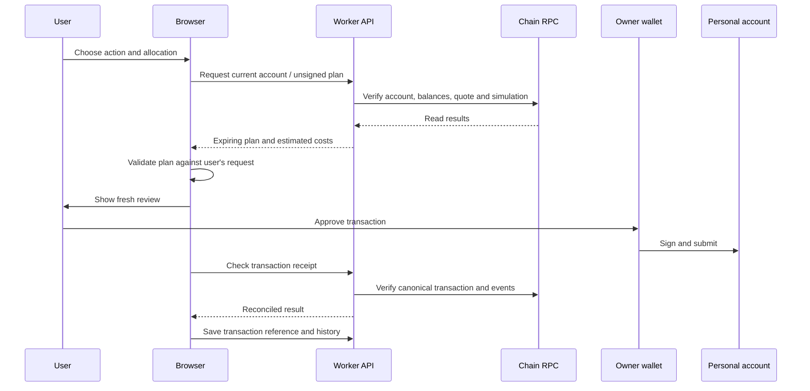

# How the Freestock backend works

[README](../README.md) · [Contracts](CONTRACTS.md) · [Developer guide](DEVELOPMENT.md)

This guide describes the current implementation. Freestock has a browser application, a Worker API, D1 persistence and read-only connections to chain and market data. The owner's browser wallet signs and submits financial transactions. There is no backend signer, keeper, model provider or autonomous pool allocator.

## Identity and trust boundaries

The wallet is the user's account identity. [`wallet-auth-service.ts`](../lib/wallet-auth-service.ts) verifies a free EIP-191 signature over the exact server-issued sign-in message. The message includes the website origin, wallet, chain 4663, nonce and five-minute expiry. A short-lived HttpOnly browser cookie binds the challenge to the browser that requested it. Nonce consumption and session creation are atomic, so concurrent replay cannot create additional sessions.

The server creates a seven-day opaque session in a host-only `HttpOnly; Secure; SameSite=Lax` cookie. D1 stores only its SHA-256 token hash, wallet and expiry. Login rotates the previous session; Disconnect revokes it. [`lib/http.ts`](../lib/http.ts) derives identity from this session and never trusts client-supplied platform identity headers. Identity is `wallet:4663:<lowercase-address>`.

Every owner-specific live endpoint requires the requested owner/address to match the authenticated wallet. Contract creation, ownership, runtime and dependencies are independently checked onchain. A sign-in signature never authorizes spending or a financial transaction and does not establish stock-provider eligibility. Every transaction still requires the owner's wallet approval.

The dashboard compares its connected wallet with the server-authenticated wallet and rechecks on focus, page restore and authentication changes. A changed session clears profile views and reviews while retaining the owner-scoped recovery journal. Old platform-profile history is not silently merged: known deployment references can be restored, reverified and saved under the wallet identity.

The simulator can initialize a separate anonymous browser session through `POST /api/demo/session`. Its cookie grants access only to simulated records and never authenticates a live-wallet endpoint. It contains no real money and requires no wallet connection.

## A live transaction, end to end

[`account-plan.ts`](../lib/live/account-plan.ts) and [`pilot.ts`](../lib/live/pilot.ts) prepare deployments and actions. Verification checks the intended chain, canonical deployment receipt, derived account address, runtime bytecode, owner and configured dependencies. A remembered address alone is not accepted as a verified position.

Preparation uses the actual sender and current state. Current plans expire after 45 seconds. Stock purchases use the configured 0.05% pool fee, minimum output 1% below the quoted amount and a 120-second transaction deadline. The application reserves two micro-USDG for rounding and applies a 20% gas-limit buffer. These are client policy choices; [contract constraints](CONTRACTS.md) differ in some places.

[`wallet-transaction.ts`](../lib/live/wallet-transaction.ts) checks the reviewed request before invoking the wallet. [`wallet-journal.ts`](../lib/live/wallet-journal.ts) stores device-local pending references for recovery, and browser locks coordinate supported tabs on that device. This is not a cross-device signing lock. An unknown transaction outcome must be reconciled before retrying an action that could spend funds again.

## Agentic Lending

[`agentic-lending.ts`](../lib/live/agentic-lending.ts) is a deterministic rule engine. It evaluates a verified account snapshot, retention preference, stock allocations, conversion minimum and ETH network-fee budget. It explains a wait, retain or purchase-review recommendation.

The plan is saved locally for the wallet; the recommendation activity view is session-local. There is no LLM call, background scheduler, delegated spender or cross-pool reallocation. A recommendation hands off to a fresh manual transaction review. The ETH gas limit is not an all-in cost percentage measured in USDG; that comparison is future work.

## Storage and accounting

| Location                            | Data                                                                   | Boundary                                                                           |
| ----------------------------------- | ---------------------------------------------------------------------- | ---------------------------------------------------------------------------------- |
| D1 `earn_accounts`, `earn_commands` | Simulation balances, positions and idempotency records                 | Simulated money; scoped to a browser demo identity or authenticated wallet profile |
| D1 `wallet_challenges`              | Short-lived messages, browser-binding hashes and consumed nonce claims | Authentication only; no spending permission                                        |
| D1 `wallet_sessions`                | Session-token hashes, wallet addresses and expiry                      | Bearer tokens are never stored directly                                            |
| D1 `live_accounts`                  | Verified account references and scan checkpoints                       | Scoped to identity, chain and wallet                                               |
| D1 `live_transactions`              | Reconciled transaction records                                         | Saved history, not a custody ledger                                                |
| D1 `accounts`, `commands`           | Legacy prize-model records                                             | Retained compatibility data; old command endpoint retired                          |
| Browser local storage               | Account references, lending plans and transaction journal              | Device-local; not authoritative chain state                                        |
| Browser memory                      | Current quotes, reviews and recommendation activity                    | Temporary session state                                                            |
| Owner wallet                        | Keys and transaction authorization                                     | Never stored by the backend                                                        |

The [D1 migrations](../drizzle) define the persisted schema. [`earn-engine.ts`](../lib/earn-engine.ts) uses integer/BigInt accounting for the simulation. [`earn-store.ts`](../lib/earn-store.ts) combines command idempotency and version checks to avoid duplicated or conflicting simulation updates. Simulation command bodies are limited to 4 KB. The model's rates, stock prices and leveraged-LP outcomes are illustrative; they do not execute transactions or model all real costs.

## Portfolio Activity and recovery

[`history-reader.ts`](../lib/live/history-reader.ts) reconciles transactions, receipts and account events against canonical blocks. [`history-store.ts`](../lib/live/history-store.ts) persists them with user scoping and optimistic version checks.

- Historical import is bounded. Log requests cover at most 5,000 blocks at a time and can shrink when results are dense; a sync is not an unlimited lifetime scan.
- Checkpoints retain canonical block information so reorganized data can be revisited. Events are deduplicated and receipt status can change after reconciliation.
- Transactions may be pending, confirmed, reverted, replaced or reorganized. Hash-based tracking and imported references allow recovery beyond the currently open browser session.
- History is paginated in groups of 50. Summary totals describe the loaded page; they are not the wallet's full holdings or lifetime earnings.
- Account events describe deposits, withdrawals, reservation/compounding and purchases. Direct transfers and donations are outside this event scan, even though they affect the account's available surplus.
- If saving history fails after a transaction succeeds, recover and save its reference. Do not submit another financial transaction merely to recreate a missing history row.

## API reference

Paths are relative to the application origin. “Identity” means a server-verified wallet-signature session. Owner-specific routes reject a different wallet with HTTP 403 before RPC or storage work. Responses are private and uncached.

| Endpoint                         | Access                                 | Purpose                                                                         |
| -------------------------------- | -------------------------------------- | ------------------------------------------------------------------------------- |
| `POST /api/auth/challenge`       | Same origin, JSON, 2 KB limit          | Issue a five-minute wallet confirmation challenge                               |
| `POST /api/auth/verify`          | Same origin + bound challenge          | Verify the exact signature and create/rotate the session                        |
| `GET /api/auth/session`          | Session cookie                         | Return authenticated wallet and expiry, never the bearer token                  |
| `POST /api/auth/logout`          | Same origin                            | Revoke session and expire cookies                                               |
| `POST /api/demo/session`         | Same origin                            | Initialize a simulation-only browser session                                    |
| `GET /api/health`                | Hosting policy                         | Product and launch status                                                       |
| `GET /api/markets`               | Hosting policy                         | Tracked USDG market catalogue; dated fallback where supported                   |
| `GET /api/stock-lending/markets` | Hosting policy                         | Five tracked stock-loan markets, read-only                                      |
| `GET /api/earn/account`          | Demo or wallet session                 | Load or initialize simulation account                                           |
| `POST /api/earn/commands`        | Demo or wallet session + same origin   | Idempotent simulation commands                                                  |
| `GET /api/live/status`           | Hosting policy; identity affects flags | Chain health, live access and hashed session scope                              |
| `GET /api/live/wallet`           | Identity                               | Read wallet balances                                                            |
| `GET /api/live/quote`            | Identity                               | Quote a supported stock purchase                                                |
| `GET /api/live/deposit-preview`  | Identity                               | Read direct-vault deposit preview                                               |
| `GET /api/live/account-plan`     | Identity                               | Prepare unsigned account creation                                               |
| `GET /api/live/pilot/account`    | Identity                               | Verify and read a personal account                                              |
| `GET /api/live/pilot/prepare`    | Identity + action policy               | Prepare/simulate deployment, approval, deposit, harvest, compound or withdrawal |
| `GET /api/live/pilot/receipt`    | Identity                               | Reconcile a transaction with chain state                                        |
| `GET /api/live/history`          | Identity                               | List saved accounts or a page of activity                                       |
| `POST /api/live/history`         | Identity + same origin                 | Remember, track or sync references; 2 KB body limit                             |
| `GET /api/account`               | Identity                               | Legacy account compatibility                                                    |
| `POST /api/commands`             | Retired                                | Returns HTTP 410                                                                |

Read the [route handlers](../app/api) for exact query parameters and validation. Live preparation produces unsigned data. None of these endpoints signs or broadcasts a financial transaction.

## Market data and execution failures

Market views show a tracked subset, not every pool on Robinhood Chain. Vault and underlying-market values can overlap, so their TVLs should not be added into a headline total. Stock-loan rates and balances are read-only; an empty market does not establish an earning opportunity.

[`markets.ts`](../lib/markets.ts), [`stock-lending-markets.ts`](../lib/stock-lending-markets.ts) and [`rpc-reader.ts`](../lib/live/rpc-reader.ts) separate data retrieval from execution. A dated catalogue snapshot may keep a browsing view useful when its provider is unavailable. Missing data must not be presented as a measured zero. Financial preparation requires fresh successful verification and simulation; a cached marketing snapshot cannot authorize a transaction.
